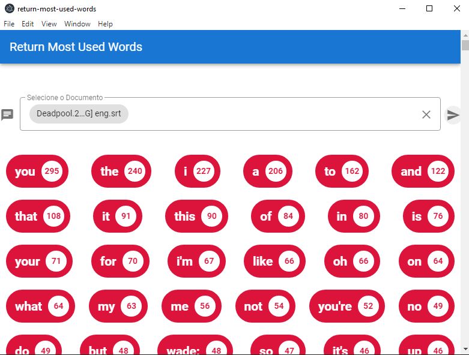

## 💻 Projeto

Projeto desenvolvido durante o **[Curso Web-Moderno JS 2020](https://www.cod3r.com.br/courses/web-moderno)**, realizada pela **[@Cod3r](https://www.cod3r.com.br/)**!! :rocket::rocket:

Tem o Objetivo de criar uma aplicação Desktop utilizando o Electron JS.

  

